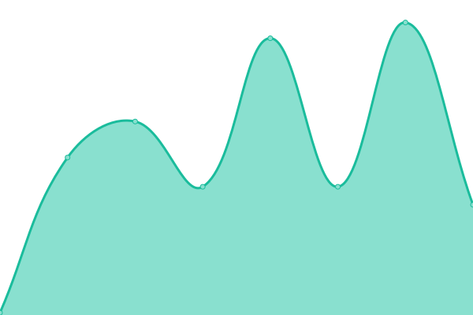

# [📈 Live Status](https://status.paycrest.io): <!--live status--> **🟧 Partial outage**

This repository contains the open-source uptime monitor and status page for [Paycrest](https://paycrest.io), powered by [Upptime](https://github.com/upptime/upptime).

With [Upptime](https://upptime.js.org), you can get your own unlimited and free uptime monitor and status page, powered entirely by a GitHub repository. We use [Issues](https://github.com/paycrest/status/issues) as incident reports, [Actions](https://github.com/paycrest/status/actions) as uptime monitors, and [Pages](https://status.paycrest.io) for the status page.

<!--start: status pages-->
<!-- This summary is generated by Upptime (https://github.com/upptime/upptime) -->
<!-- Do not edit this manually, your changes will be overwritten -->
<!-- prettier-ignore -->
| URL | Status | History | Response Time | Uptime |
| --- | ------ | ------- | ------------- | ------ |
|  [Aggregator](https://api.paycrest.io/health) | 🟩 Up | [aggregator.yml](https://github.com/paycrest/status/commits/HEAD/history/aggregator.yml) | 

 616ms
     
 | 

<a href="https://status.paycrest.io/history/aggregator">100.00%</a>
    

|  [Noblocks](https://noblocks.xyz) | 🟩 Up | [noblocks.yml](https://github.com/paycrest/status/commits/HEAD/history/noblocks.yml) | 

 113ms
     
 | 

<a href="https://status.paycrest.io/history/noblocks">100.00%</a>
    

|  [Noblocks Rates](https://rates.noblocks.xyz) | 🟩 Up | [noblocks-rates.yml](https://github.com/paycrest/status/commits/HEAD/history/noblocks-rates.yml) | 

 111ms
     
 | 

<a href="https://status.paycrest.io/history/noblocks-rates">100.00%</a>
    

|  [NIBBS (Funds Transfer)](https://public-api.freshstatus.io/v1/public-components/?account_id=21373) | 🟥 Down | [nibbs-funds-transfer.yml](https://github.com/paycrest/status/commits/HEAD/history/nibbs-funds-transfer.yml) | 

 868ms
     
 | 

<a href="https://status.paycrest.io/history/nibbs-funds-transfer">0.00%</a>
    

|  [NIBBS (Transaction Status Query)](https://public-api.freshstatus.io/v1/public-components/?account_id=21373) | 🟥 Down | [nibbs-transaction-status-query.yml](https://github.com/paycrest/status/commits/HEAD/history/nibbs-transaction-status-query.yml) | 

 53ms
     
 | 

<a href="https://status.paycrest.io/history/nibbs-transaction-status-query">0.00%</a>
    

|  [NIBBS (Name Enquiry)](https://public-api.freshstatus.io/v1/public-components/?account_id=21373) | 🟥 Down | [nibbs-name-enquiry.yml](https://github.com/paycrest/status/commits/HEAD/history/nibbs-name-enquiry.yml) | 

 57ms
     
 | 

<a href="https://status.paycrest.io/history/nibbs-name-enquiry">0.00%</a>
    

|  [Dashboard](https://app.paycrest.io) | 🟩 Up | [dashboard.yml](https://github.com/paycrest/status/commits/HEAD/history/dashboard.yml) | 

 479ms
     
 | 

<a href="https://status.paycrest.io/history/dashboard">100.00%</a>
    

|  [Landing page](https://paycrest.io) | 🟩 Up | [landing-page.yml](https://github.com/paycrest/status/commits/HEAD/history/landing-page.yml) | 

 540ms
     
 | 

<a href="https://status.paycrest.io/history/landing-page">100.00%</a>
    

<!--end: status pages-->

[**Visit our status website →**](https://status.paycrest.io)

## 📄 License

- Powered by: [Upptime](https://github.com/upptime/upptime)
- Code: [MIT](./LICENSE) © [Anand Chowdhary](https://anandchowdhary.com), supported by [Pabio](https://pabio.com)
- Data in the `./history` directory: [Open Database License](https://opendatacommons.org/licenses/odbl/1-0/)
